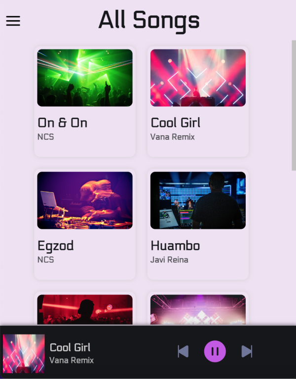

# Music Land :

- A responsive online music player that can be browser through genres and search for music by name, album and song title.
- This is my first project that invovle with sound! All music in this project are by SoundCloud. 

# Built with 🛠️:
- React
- TypeScript
- HTML
- CSS
- Figma
- Netlify

# Live Demo:
[Live Demo Link] (https://beautiful-malasada-027c15.netlify.app/)

## Available Scripts
In the project directory, you can run:
`npm start`

Runs the app in the development mode.\
Open [http://localhost:3000](http://localhost:3000) to view it in the browser.

The page will reload if you make edits.\
You will also see any lint errors in the console.
`npm test`

# Author:
👩 **Katy Rosli**
- GitHub: [@KatyRosli](https://github.com/KatyRosli)

# Show your support:
Give a ⭐️ if you like this project!

Thank you!